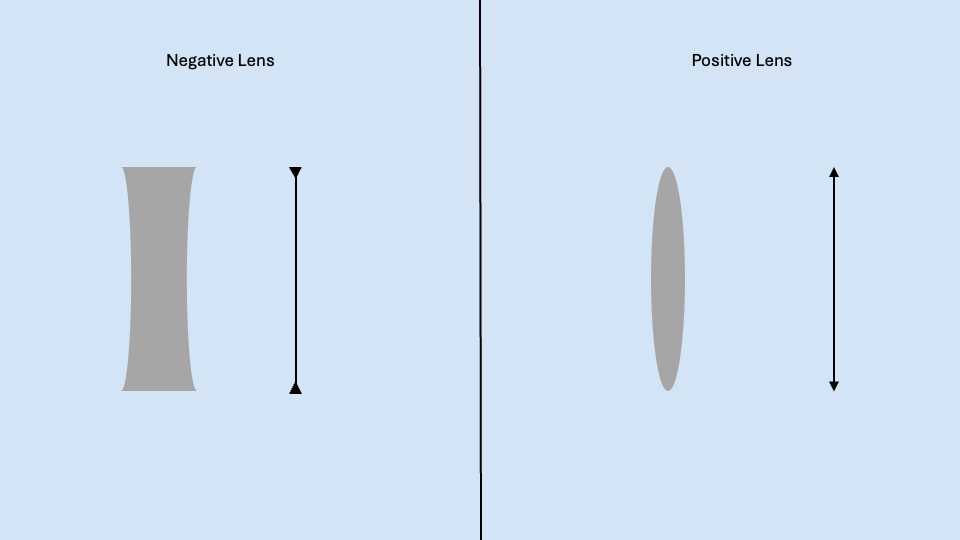

Last Time we found the ABCD matrix for a ray traveling through free space with refractive index $n_1$. This was interesting but to develop more complex optical systems we need to find ways to mathematically treat different components of these systems including:

1. A Free Space
2. A flat interface
3. A thin lens
4. A Curved Interface

--- 
## Free Space

As we learned in class last time, if we want to find a new vector from an original after traveling a distance, $d$, across a free space of refractive index $n$, we can use the matrix

$$
\bar{m} = 
\begin{pmatrix}
1 & \frac{d}{n_1} \\
0 & 1
\end{pmatrix}
$$

To use this matrix, we can take our original vector, $\vec{f}_1$ and multiply by $\bar{m}$ to find $\vec{f}_2$

$$
\begin{pmatrix}
y_2 \\
n_2 u_2
\end{pmatrix} =
\begin{pmatrix}
1 & \frac{d}{n_1} \\
0 & 1
\end{pmatrix}
\begin{pmatrix}
y_1 \\
n_1 u_1
\end{pmatrix}
$$

## Flat Interface
From here, it would be beneficial to have a way to represent the interaction of our ray with a flat interface between a region with refractive index $n_1$ and $n_2$. Much like how we solved for our ABCD matrix last time, we will set up the equation

$$
\begin{pmatrix}
y_2 \\
n_2 u_2
\end{pmatrix} =
\begin{pmatrix}
A y_1 + B n_1 u_1 \\
C y_1 + D n_1 u_1
\end{pmatrix}
$$

and then find other equations which connect $y_2$ and $n_2 u_2$ with $y_1$ and $n_1 u_1$ to find the coefficients. 

Going forward to solve this type of problem it is very useful to draw a diagram and look at the problem graphically. 

In this graphic we can see that a vector $\vec{f}_1$ hits a flat interface and transitions to $\vec{f}_2$. In the blown up graphic, we see that the height of $y_2$ is equal to the height of $y_1$ immediately to the left and right of the interface giving the equation 

$$y_2 = y_1 + 0(n_1u_1)$$

*The $0(n_1u_1)$ term will make more sense after evaluating the next optical component*

We know Snell's law to be 

$$n_1 \sin{\theta_1} = n_2 \sin{\theta_2}$$
using our paraxial approximation we know $\sin{\theta} = \theta$ and using the y nu terminology $\theta_n = u_n$ giving the equation

$$n_1 u_1 = 0(y_1) + n_2 u_2$$

Now we can look at our two equations with the expanded ABCD matrix and try to match coefficients:

$$
\begin{pmatrix}
y_2 \\
n_2 u_2
\end{pmatrix} =
\begin{pmatrix}
A y_1 + B n_1 u_1 \\
C y_1 + D n_1 u_1
\end{pmatrix}
$$

$$y_2 = y_1 + 0(n_1u_1)$$

$$n_1 u_1 = 0(y_1) + n_2 u_2$$

From this we can see clearly that our coefficients will be $A=1$, $B=0$, $C=0$, $D=1$ giving the flat interface matrix:

$$
\bar{m} = 
\begin{pmatrix}
1 & 0 \\
0 & 1
\end{pmatrix}
= \bar{I}
$$

## Thin Lens
The next optical component we will consider is that of a *thin lens*. This is an approximation that neglects the thickness of the lens itself and is essentially a plane that affects the incoming ray as if it were an actual lens. 

Like a traditional lens, the thin lens has a focal length $\mathcal{f}$ which is the same on both sides of the lens. 

When we say focal length we mean that when parallel rays (collimated light) enters the lens in optical space, those rays will all intersect at one point a distance $\mathcal{f}$ from the lens in image space. The inverse is also true, a point source in optics space will result in collimated light in image space (*see diagrams in respective sections below*).

**Parallel Source**

**Point Source**

When using the thin lens approximation, we will draw negative and positive lenses in the following way to ensure we know we are making this approximation:

To figure out our ABCD matrix, we need both the parallel source and point source. When we derive our ABCD matrix for a positive lens, it will also work for a negative lens. 

We will begin with looking at the parallel source.

### **Parallel Source**

Our initial vector $\vec{f}_1$ can have an initial height with any $y_1$ because all parallel rays will cross at $\mathcal{f}$ in image space. We also know that the incoming light is all parallel which means it interacts orthogonally to the thin lens meaning $n_1 u_1 = 0$. Combining these we see

$$\vec{f_1} = 
\begin{pmatrix}
y_1 \\
n_1 u_1
\end{pmatrix} =
\begin{pmatrix}
y_1 \\
0
\end{pmatrix}$$

Now, choosing an arbitrary $\vec{f}_1$ we can draw the right triangle with sides $y_1$ and $\mathcal{f}$. If we want to find $n_2 u_2$ we can use trigonometry and see that (using the paraxial approximation) $\tan{\theta_2} = \frac{y_1}{\mathcal{f}} \approx u_2$ we need this in terms of $n_2 u_2$ so we can multiply creatively by $1 = \frac{n_2}{n_2}$ to get

$$\frac{y_1}{\mathcal{f}} = \frac{n_2 u_2}{n_2} \rightarrow n_2 u_2 = \frac{n_2}{\mathcal{f}}y_1$$

now we have 2 equations that we can use to help solve for some of our ABCD coefficients:

$$y_2 = y_1$$

$$n_2 u_2 = \frac{n_2}{\mathcal{f}}y_1$$

$$
\begin{pmatrix}
y_2 \\
n_2 u_2
\end{pmatrix} =
\begin{pmatrix}
A y_1 + B n_1 u_1 \\
C y_1 + D n_1 u_1
\end{pmatrix}
$$

This lets us see clearly that $A=1$ and $C= \frac{n_2}{\mathcal{f}}$ but we can not say anything about $B$ or $D$. To find these coefficients, we need the other picture starting from a point source in optics space that creates parallel lines in image space. 

### **Point Source**

Here we can perform the same treatment seeing that immediately before and after the interface $y_2 = y_1$ and after the lens, $n_2 u_2 = 0$. We can use the same trick we did before to draw a right triangle with the ray in optics space, the height $y_1$ and the focal length $\mathcal{f}$ (*yellow highlight*)

Here we make the same approximation as before and see that 

$$\tan{\theta_1} = \frac{y_1}{\mathcal{f}} \approx \frac{n_1 u_1}{n_1}$$

which we can then rearrange to get

$$n_1 u_1 = \frac{n_1}{\mathcal{f}} y_1$$

now we can subtract the right hand side to get 

$$n_1 u_1 - \frac{n_1}{\mathcal{f}} y_1 = 0$$

Then, knowing that $n_2 u_2 =0$ (parallel rays in image space) We can solve for the remaining coefficients:

$$ n_1 u_1 - \frac{n_1}{\mathcal{f}} y_1 = n_2 u_2$$

$$y_2 = A y_1 + B n_1 u_1$$

$$n_2 u_2 = C y_1 + D n_1 u_1$$ 

*Some how C is positive when solved for previously and negative here. This may be due to an assumption that $\mathcal{f}$ is positive in one direction and negative in the other*

$$
\begin{pmatrix}
y_2 \\
n_2 u_2
\end{pmatrix} =
\begin{pmatrix}
1 (y_1) + 0 (n_1 u_1) \\
\frac{n_2}{f} (y_1) + 1 (n_1 u_1)
\end{pmatrix}
$$

So the final ABCD matrix for a thin lens with positive or negative focal length is 

$$
\bar{m}= 
\begin{pmatrix}
1 & 0   \\
\frac{n_2}{f}  & 1
\end{pmatrix}
$$

## Curved Interface
*This was not derived in class, it may be a homework problem*

Parallel rays entering the curved lens will cross at the focal point $\mathcal{f} = \frac{1}{2}R$ with $R$ being the radius of curvature of the lens. The sign convention from $R$ follows the direction of the light entering the lens. If it is hitting the convex side, $R>0$. If the light is hitting the concave side of the lens, $R<0$.

**Positive R**

**Negative R**

The transition matrix for a curved lens is

$$
\bar{m}= 
\begin{pmatrix}
1 & 0   \\
\frac{n_1 - n_2}{R}  & \frac{n_1}{n_2}
\end{pmatrix}
$$

## Thick Lens

When we combine all of our parts, we can make our first optical device: a thick lens. 

Here $\mathcal{F}'$ is called the back focal plane. All quantities in image space will adopt this $X'$ notation to distinguish them from optics space. 

To find the ABCD matrix of a thick lens we will follow these steps
- Create input rays ($\vec{f}_1$ parallel to the lens and interacting at an angle)
- Transfer rays across $R_1$ using the matrix for a curved lens here called $\bar{m}_2$ creating $\vec{f}_2$
- Move $\vec{f}_1$ through the lens from $R_1$ to $R_2$ using the free space matrix, $\bar{m}_3$, making $\vec{f}_3$
- Transfer rays across $R_2$ using the curved lens matrix $\bar{m}_4$ which makes $\vec{f}_4$

The total equation will be

$$
\vec{f}_5 = \bar{m}_4 \bar{m}_3 \bar{m}_2 \vec{f}_1 
$$

We can simplify this by writing one total transfer matrix for this problem

$$
\bar{m}_T =  \bar{m}_4 \bar{m}_3 \bar{m}_2
$$

## Arbitrary Optical System

We can generalize this to any arbitrary optical system with $j$ elements which will have the transfer matrix:

$$\bar{m}_T =  \bar{m}_{j} \bar{m}_{j-1}... \bar{m}_{2} \bar{m}_{1}$$

*How can we find $\mathcal{F}$ and $\mathcal{F}'$?*

$\mathcal{F}'$ is defined to be the "back focal plane". The distance between the last optical element and $\mathcal{F}'$ is called the "back working distance", $\mathcal{w}'$