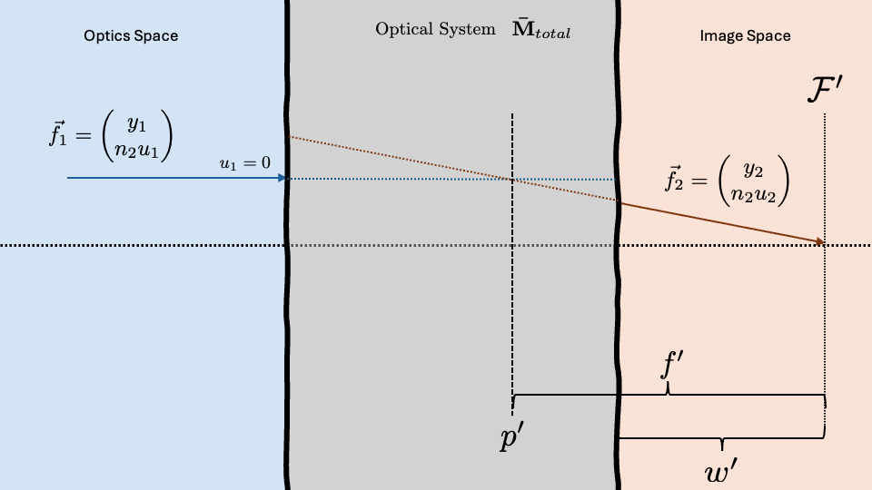
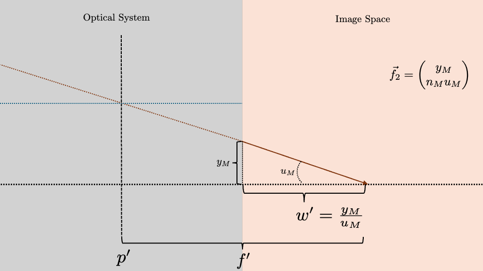
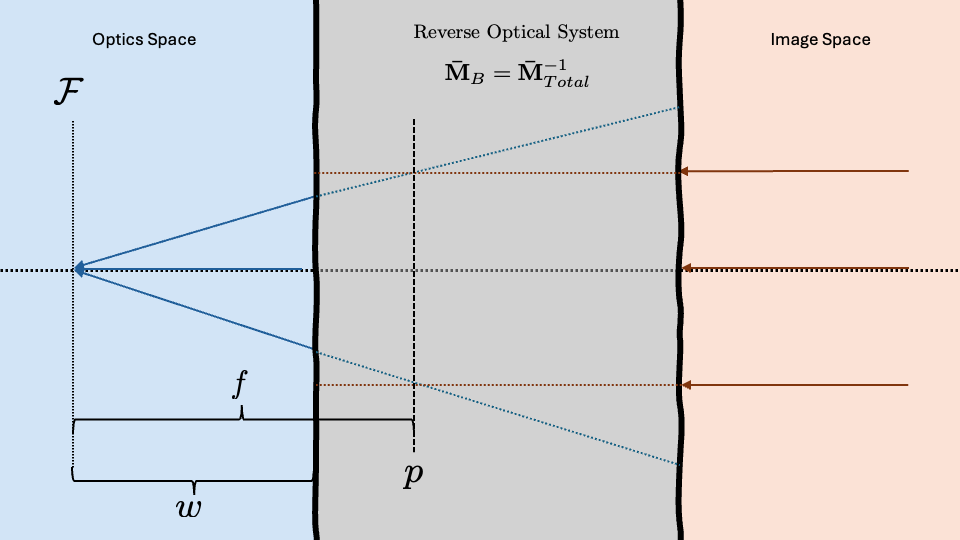

# Review

Last time we found the transfer matrices for 4 different optical elements
- Free Space: $ \bar{m} = 
\begin{pmatrix}
1 & \frac{d}{n_1} \\
0 & 1
\end{pmatrix}$  

- Flat Interface: $\bar{m} = 
\begin{pmatrix}
1 & 0 \\
0 & 1
\end{pmatrix}$  

- Thin Lens: $\bar{m} = 
\begin{pmatrix}
1 & 0   \\
\frac{n_2}{f}  & 1
\end{pmatrix}$  

- Curved Interface: $\bar{m}= 
\begin{pmatrix}
1 & 0   \\
\frac{n_1 - n_2}{R}  & \frac{n_1}{n_2}
\end{pmatrix}$

We also saw that we could combine these elements to create a more complex optical system like a thick lens composed of two curved interfaces and free space surrounding both. 

# New Material
**How do we define $\mathcal{F}$ and how can we find $\mathcal{F}$ for a whole system?** 

## Arbitrary Optical Systems
When we create an arbitrary optical system, we can approximate the entire system with a single optical element within the system at position $p'$ that takes our initial vector $\vec{f}_1$ and transfers it to $\vec{f}_2$. This single element will have an ABCD matrix equal to the transfer matrix $\mathbf{\bar{M}}_T$. $p'$ is found by extending vectors $\vec{f}_1$ and $\vec{f}_2$ into the optical system, represented by the dotted lines in the figure below. 

There are 6 cardinal planes within an optical system. Today we will discuss 4 of them:
- Front Focal Plane: $\mathcal{F}$
- Front Principle Plane: $p$
- Back Focal Plane: $\mathcal{F}'$
- Back Principle Plane: $p'$

The primed elements represent elements in image space and can be seen in the figure above.

### Back Cardinal Planes
#### Back Focal Plane

We want to find the position of the back focal plane. The back focal plane is found by finding the focal distance $f'$ from the back principle plane $p'$. As seen in the figure below, we can draw a triangle with the height $y_2$ and hypotenuse $\vec{f}_2$. We also know with the paraxial approximation that $\tan{\theta_2} \approx u_2$ and basic trig tells us $\tan{\theta}=\frac{opposite}{adjacent}$ so we can use the equation 

$$
u_2 = \frac{y_2}{f'} \rightarrow f' = \frac{y_2}{u_2}
$$

If we know all of the optical elements of the system, we know $\mathbf{\bar{M}}_T$. We can then use $\vec{f}_2 = \mathbf{\bar{M}}_T \vec{f}_1$ to find the output vector. 

In this figure, the input ray can be any arbitrary height because all parallel rays in optics space will cross at the **back focal plane**, $\mathcal{F}'$, in image space. We also know that because $\vec{f}_1$ is parallel, then $\theta_1$ and ultimately $u_1 = 0$

$$
\vec{f_1} = 
\begin{pmatrix}
y_1 \\
0
\end{pmatrix}
$$

We have a transfer matrix that will be a 2x2 matrix. The coefficients will be complicated because it will be a multiplication of each element's ABCD matrix but we can write our output ray generally as:

$$ 
\begin{pmatrix}
A_T & B_T   \\
C_T  & D_T
\end{pmatrix}
\vec{f_1} = 
\begin{pmatrix}
y \\
0
\end{pmatrix}
$$

This gives the result 

$$
\vec{f_2} = 
\begin{pmatrix}
y_M \\
n_M u_M
\end{pmatrix} =
\begin{pmatrix}
A_T y + B 0 \\
C_T y + D 0
\end{pmatrix}
$$

We can zoom in to the right hand side of our system to define more variables:

#### Back Principle Plane
We can extend the incoming ray $\vec{f_1}$ into the optical system (shown with the blue dotted line) and extend the outgoing ray, $\vec{f_2}$ backwards into the optical system (red dotted line). These two lines will cross at a so called "*phantom lens*" within the optical system that transitions $\vec{f}_1$ to $\vec{f}_2$. The position of this *phantom lens* defines the **back principle plane**.

#### Back Working Distance
Here we can see that we are able to create a triangle like we did before with a height $y_M$ and base $w'$. We can use the small angle approximation for $\tan{\theta}$ as we did before to define the **back working distance** of our optical system, $w'$.

$$
u_M = \frac{y_M}{w'} \rightarrow w' = \frac{y_M}{u_M}
$$

## Front Cardinal Planes

If we perform the same treatment but start with collimated light in image space passing backwards through the optical system to optics space we can define the corollary cardinal planes to the ones defined above. 

To pass a ray from image space to optics space, we need to reverse the optical system. We can do this by taking the inverse of the total transfer matrix

$$
\mathbf{\bar{M}}_B = \mathbf{\bar{M}}_T^{-1}
$$

Here we can see that $\mathcal{F}$, $p$, and $m$ are all defined using the same treatment they were given in image space. Here they are given the names:
- Front Focal Plane: $\mathcal{F}$
- Front Principle Plane:  $p$
- Front Working Distance: $w$
It is important to note that $f \neq f'$ and $\mathcal{F}$ is not always the same working distance from the optical system as $\mathcal{F}'$. These two will be the same under very specific symmetry conditions.  