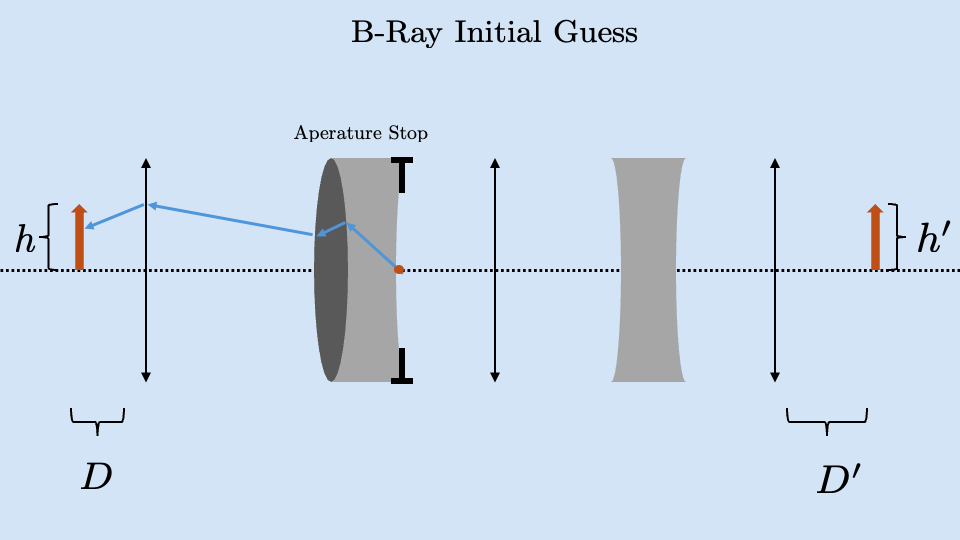

# Cardinal Points

Last time we discussed the first 4 of the 6 *cardinal points* of an optics system. Those were the front focal plane $\mathcal{F}$, the front principle plane $p$, the back principle plane $p'$ and the back focal plane $\mathcal{F}'$. We were very consistent with our drawing in that they always appeared in the order $\mathcal{F}$, $p$, $p'$, $\mathcal{F}'$. This is a good way of gaining intuition for the subject but it is not necessarily the correct representation. 

There are many optical system that have the cardinal points in this order but there is nothing stopping the back principle plane from being in front of the front focal plane. The 4 planes we discussed are in no particular order and van change significantly depending on the optical system under consideration. 

## Nodal Points

The last two cardinal points are the front ($N$) and rear ($N'$) nodal points. These will not come up again in the course as they are mainly used when testing optical system. The test using nodal points is a *nodal slide bench test* which looks at the resulting change of exit vector when varying the input vector. 

Nodal points are important because if we input a ray which is aimed at the front nodal point in optics space. The resulting ray in image space will appear as if it originated at the back nodal point making the same angle with the optical axis. 

# Imaging in Complex Systems

Imaging with a single lens is something we learned in physics 1 and can be done very simply. We can use this simple solution multiple times to build up a complex system. This can tell us about the image we will end up with but we have no way of knowing how much light passed through the system. 

If we have an object in *optics space* (the arrow on the left of this example) and we want to know about its image in *image space* (specifically its height, $h'$ and distance from the system, $D'$) we need to find two vectors, the *Axial Ray* and the *Chief Ray*. Textbooks will use the same name for these two rays but they way they are represented and referred to colloquially changes depending on where the author studied. One methodology traces its roots back to Arizona and the other back to Rochester. **I will use the Rochester notation in these notes**

=== "Rochester"
    Axial Ray: 
    ("A-Ray")
    $\begin{pmatrix}
    y_a \\
    n u_a 
    \end{pmatrix}$ 
    
    Chief Ray:
    ("B-Ray")
    $\begin{pmatrix}
    y_b \\
    n u_b 
    \end{pmatrix}$ 
    

=== "Arizona"
    Axial Ray:
    $\begin{pmatrix}
    y \\
    n u 
    \end{pmatrix}$ 

    Chief Ray
    $\begin{pmatrix}
    y \\
    n u 
    \end{pmatrix}$ 

The axial (A) ray refers to a ray that originates on the optical axis ($h=0$) at point $D$ with an angle such that when the ray is propagated through the system, it hits the side of the optical element with the smallest aperture

The chief (B) ray is a ray which once found, will propagate through the system beginning on the optical axis at the point of the aperture stop. This ray will exit the system and ends at point $D'$ with a height equal to the final image height $h'$

The process of finding each of these rays will make it more clear what their use is. To begin the process of finding these, we will start with identifying the A-ray.

## A-Ray

To find the A-ray, we first make a guess of what the A-ray is by creating a vector on the optical axis ($y_a=0$) and making a random angle with the optical axis ($\theta_a$ or $\frac{n u_a}{n}$)

We can propagate this initial guess through the system and identify the optical element with the smallest aperture (the element which the initial guess ray is closest to contacting the edge of). We will call this element of the system the **aperture stop** often marked with the "T" shapes seen below.

From here, we will go back and scale the angle of our vector such that it barely contacts the side of the aerate stop. The vector that originates at $y_a=0$ at point $D$ that has an angle, $\frac{n u_a}{n}$, making it meet this qualification is defined as the **A-Ray**

---

## B-Ray

We find the B-ray in three steps. The first step is to create a ray originating on the optical axis ($y_b = 0$)at the position of our aperture stop. We again choose an arbitrary angle ($\theta_b$ or $\frac{n u_b}{n}$) and trace the ray *backwards* through the system. 

Now we can scale the angle of our vector such that at point $D$ in optics space, the ray touches the top of the object we are imaging. 

Once we have the ray that meets this qualification, this is the **B-ray**. We can now pass it forwards through the system and when it exits the optical system, at position $D'$, this ray will be at the y position equal to the image height $h'$.

# Imaging in Complex Systems

The A-ray and B-Ray are important because every other ray in the system is a linear combination of these two rays:

$$
\begin{pmatrix}
y \\
n u 
\end{pmatrix} = \aleph
\begin{pmatrix}
y_a \\
n u_a 
\end{pmatrix} + \beth
\begin{pmatrix}
y_b \\
n u_b 
\end{pmatrix}
$$

With $\aleph$ and $\beth$ being arbitrary coefficients that can be found when needed.

The A and B rays are also important because the "information" in the system can be described by the **Lagrangian Variant**, $H$:

$$
H = [n u_a \cdot y_b]- [n u_b \cdot y_a]
$$

$H$ will be constant and should be calculated at each interface to ensure this holds. 